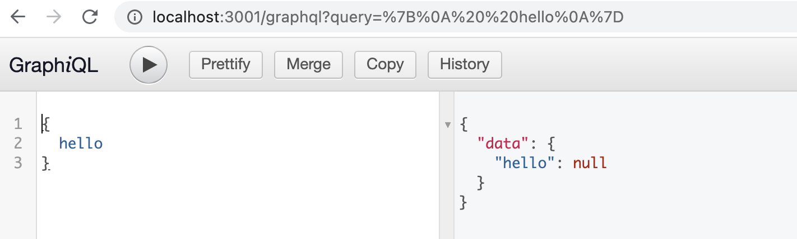
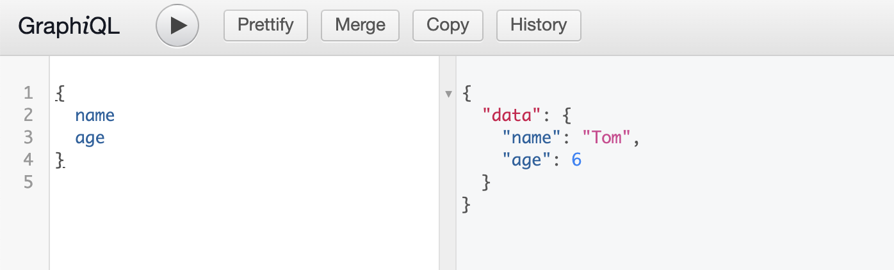
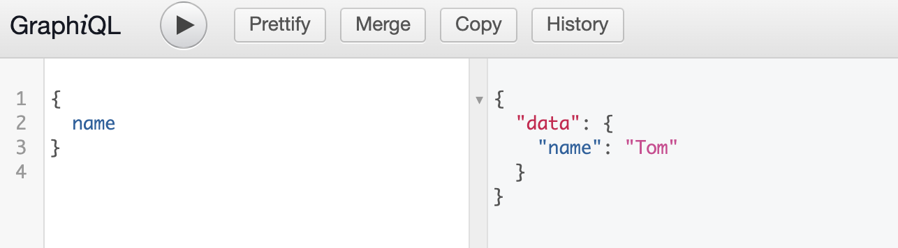
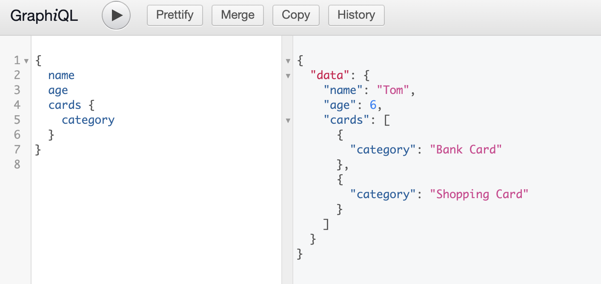
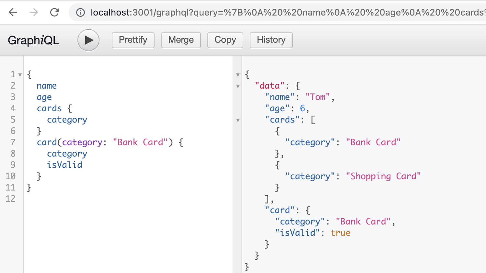

# What is GraphQL
* GraphQL is a query language for APIs and a runtime for fulfilling those queries with your existing data.
* GraphQL provides a complete and understandable description of the data in your API, gives clients the power to ask for exactly what they need and nothing more, makes it easier to evolve APIs over time, and enables powerful developer tools.
* Ask for what you need, get exactly that

## Compare with REST
* GraphQL queries can traverse related objects and their fields, letting clients fetch lots of related data in one request, instead of making several roundtrips as one would need in a classic REST architecture.
* In a system like REST, you can only pass a single set of arguments - the query parameters and URL segments in your request. But in GraphQL, every field and nested object can get its own set of arguments, making GraphQL a complete replacement for making multiple API fetches. 

# Create a Backend Project

```
mkdir backend
cd backend 
npm init -y
npm i express graphql express-graphql --save
npm i @types/express @types/node nodemon ts-node typescript  --save-dev
```

package.json scripts
```
 "start": "nodemon --exec ts-node src/index.ts",
```

## Create a server by express.js

backend/src/index.ts
```
import express, { Express, Request, Response } from 'express';

const app: Express = express()

app.use('/graphql', function(req: Request, res: Response) {
    res.end('graphql')
})

app.listen(3001, () => {
    console.log('server started on 3001')
})
```

Then run `npm start`, we can see the log of `server started on 3001`, and visit `http://localhost:3001/graphql`, we can see `graphql page` on the page.

## Convert `/graphql` router to graphql api by graphqlHTTP
 
```diff
+import {graphqlHTTP} from 'express-graphql'
+import {buildSchema} from 'graphql'
 
 const app: Express = express()
 
-app.use('/graphql', function(req: Request, res: Response) {
-    res.end('graphql page')
-})
+const schema = buildSchema(`
+    type Query {
+        hello: String
+    }
+`)
+
+app.use('/graphql', graphqlHTTP({
+    schema,
+    graphiql: true,
+}))

```
Since we configured `graphqlHTTP` with `graphiql: true`. We can use the `GraphiQL` to manually issue GraphQL queries.
If we navigate in a browser to `http://localhost:3001/graphql`, we could see an interface that let us enter queries.



# Brief introduction about GraphQL 

## GraphQL queries Fields
``` diff
 const schema = buildSchema(`
     type Query {
-        hello: String
+        name: String
+        age: Int
     }
 `)
 
+const rootValue = {
+    name() {
+        return 'Tom'
+    },
+    age() {
+        return 6
+    }
+}
+
 app.use('/graphql', graphqlHTTP({
     schema,
     graphiql: true,
+    rootValue,
 }))

```
We can use interface to query data.



We can always get back what we expect, and the server knows exactly what fields the client is asking for.



## Fields refers to Objects

We can use `sub-selection` of fields for that object.

```diff
const schema = buildSchema(`
    type Query {
        name: String
        age: Int
+       cards: [Card]
    }
+   type Card {
+       category: String
+       isValid: Boolean
+   }
`)

const rootValue = {
    name() {
        return 'Tom'
    },
    age() {
        return 6
    },
+   cards() {
+       return [
+           {category: 'Bank Card', isValid: true},
+           {category: 'Shopping Card', isValid: false},
+       ]
+   }
}


```




## Arguments

```diff
const schema = buildSchema(`
    type Query {
        name: String
        age: Int
        cards: [Card]
+       card(category: String): Card
    }
    type Card {
        category: String
        isValid: Boolean
    }
`)

+ interface ICard {
+    category: string,
+    isValid: boolean,
+ }

+ const cards: ICard[] = [
+    {category: 'Bank Card', isValid: true},
+    {category: 'Shopping Card', isValid: false},
+ ]


const rootValue = {
    name() {
        return 'Tom'
    },
    age() {
        return 6
    },
    cards() {
-       return [
-           {category: 'Bank Card', isValid: true},
-           {category: 'Shopping Card', isValid: false},
-       ]
+       return cards
+   },
+   card({category}: ICard) {
+      return cards.find(item => item.category === category)
    }
}
```


## Mutations


// todo cancel the previous query.
